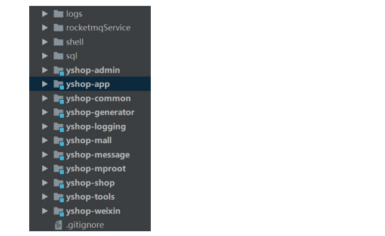

###  **[B2C微服务系统、B2B2C多商户系统、餐饮点餐系统，请移步](https://www.dayouqiantu.cn)** 


<h1 style="text-align: center">yshop意象商城系统</h1>

#### 项目简介
yshop基于当前流行技术组合的前后端分离商城系统： SpringBoot2+MybatisPlus+SpringSecurity+jwt+redis+Vue的前后端分离的商城系统， 包含分类、sku、运费模板、素材库、小程序直播、拼团、砍价、商户管理、 秒杀、优惠券、积分、分销、会员、充值、多门店等功能，更适合企业或个人二次开发；


# 官网体验地址（里面有演示地址与文档）
|  官网文档地址  |  https://www.dayouqiantu.cn |
|---|---|
| 管理后台演示地址：  |   https://demo2.yixiang.co |
| 关注公众号点击单商户体验小程序与H5  |   |


#### 核心依赖

| 依赖              | 版本     |
|-----------------|--------|
| Spring Boot     | 2.7.x |
| weixin-java     | 4.4.0  |
| Spring Security | 2.7.10 |
| Mybatis Plus    | 3.5.2  |
| hutool          | 5.8.16 |
| swagger         | 3.0.0  |

# 本地安装
### 基本环境（必备）
- 1、JDK：8+
- 2、Redis 3.0+
- 3、Maven 3.0+
- 4、MYSQL 5.7+
- 5、Node v8+
### 开发工具
Idea、webstorm、vscode

### 后台系统工程（JAVA端）

1、请确保redis已经安装启动

2、下载代码
```
git clone https://gitee.com/guchengwuyue/yshopmall.git
```
3、idea打开项目加载依赖目录如下：




4、导入数据库，配置开发环境数据库信息及其redis信息，文件路径如下：


5、然后在父级pom.xml输入命令 mvn clean install 或者用idea工具操作


6、启动程序，启动程序路径如下：


### 后台前端工程（VUE端）
1、请确保本地已经安装node,建议node8或者node10

2、下载代码
```
git clone https://gitee.com/guchengwuyue/yshopmall_qd
```
3、cnpm install或者yarn install,当前所有命令必须当前工程目录下进行，目录结构如下：


4、安装依赖失败
```
npm config set registry https://registry.npm.taobao.org
配置后可通过下面方式来验证是否成功
npm config get registry

在 ~/.npmrc 加入下面内容，可以避免安装 node-sass 失败
sass_binary_site=https://npm.taobao.org/mirrors/node-sass/

.npmrc 文件位于
win：C:\Users\[你的账户名称]\.npmrc
linux：直接使用 vi ~/.npmrc
```
5、在控制台输入命令：npm run dev，控制台打印出如下画面，恭喜表示本项目启动成功拉。


5、打开浏览器输入地址如图：

默认超管账户密码：admin/123456


# nginx线上部署

### 后台系统（Java端）

1、mvn install 或者直接idea打成jar包

2、配置nginx 反向代理如下：
```
server{ 
 listen 443 ssl;
 server_name yshopapi.dayouqiantu.cn;
        #listen [::]:81 default_server ipv6only=on;
 #ssl on;
 ssl_certificate httpssl/3034302_yshopapi.dayouqiantu.cn.pem;
 ssl_certificate_key httpssl/3034302_yshopapi.dayouqiantu.cn.key;
 ssl_session_timeout 5m;
 ssl_ciphers ECDHE-RSA-AES128-GCM-SHA256:ECDHE:ECDH:AES:HIGH:!NULL:!aNULL:!MD5:!ADH:!RC4;
    ssl_protocols TLSv1 TLSv1.1 TLSv1.2;
 ssl_prefer_server_ciphers on;
 

 #error_page   404   /404.html;
 #include enable-php.conf;
   
 location / {
  proxy_pass http://127.0.0.1:8000;
  proxy_set_header X-Forwarded-Proto $scheme;
         proxy_set_header X-Forwarded-Port $server_port;
         proxy_set_header X-Forwarded-For $proxy_add_x_forwarded_for;
         proxy_set_header Upgrade $http_upgrade;
         proxy_set_header Connection "upgrade";
 }
 
      
 access_log  /home/wwwlogs/yshopapi.log;
 
}
```

我配置的了ssl证书，如果不需要证书配置如下即可：

```
server{ 
 listen 80;
 server_name yshopapi.dayouqiantu.cn;
        #listen [::]:81 default_server ipv6only=on;

 #error_page   404   /404.html;
 #include enable-php.conf;
   
 location / {
  proxy_pass http://127.0.0.1:8000;
  proxy_set_header X-Forwarded-Proto $scheme;
         proxy_set_header X-Forwarded-Port $server_port;
         proxy_set_header X-Forwarded-For $proxy_add_x_forwarded_for;
         proxy_set_header Upgrade $http_upgrade;
         proxy_set_header Connection "upgrade";
 }
  
 access_log  /home/wwwlogs/yshopapi.log;
 
}
```


### 后台前端工程（VUE端）
1、输入命令：npm run build:prod 编译打包

2、把打包后的dist目录代码上传到服务器

3、配置nginx如下：
```
server
{
        listen 443 ssl;
        #listen [::]:81 default_server ipv6only=on;
 server_name www.yixiang.co;
 #ssl on;
 ssl_certificate httpssl/3414321_www.yixiang.co.pem;
 ssl_certificate_key httpssl/3414321_www.yixiang.co.key;
 ssl_session_timeout 5m;
 ssl_ciphers ECDHE-RSA-AES128-GCM-SHA256:ECDHE:ECDH:AES:HIGH:!NULL:!aNULL:!MD5:!ADH:!RC4;
    ssl_protocols TLSv1 TLSv1.1 TLSv1.2;
    ssl_prefer_server_ciphers on;
    index index.html;
    root /home/wwwroot/system/yshop;


    location / {
        try_files $uri $uri/ @router;
        index index.html;
·   }
 location @router {
  rewrite ^.*$ /index.html last;
 } 


 location ~* \.(eot|ttf|woff)$ {
              #  add_header Access-Control-Allow-Origin *;
        }

        location ~ .*\.(gif|jpg|jpeg|png|bmp|swf)$
        {
            expires      30d;
        }

        location ~ .*\.(js|css)?$
        {
            expires      12h;
        }
 
      
 access_log  /home/wwwlogs/yshop.log;
 
}

```

不需要证书如上面Java端配置一样去掉相关证书配置 改监听端口80即可


# docker部署

- 1、创建一个存储第三方软件服务Docker Compose文件目录：
```
     mkdir -p /yshop/soft
```
- 2、然后在该目录下新建一个docker-compose.yml文件：
```
    vim /yshop/soft/docker-compose.yml
```
- 3、接着创建上面docker-compose.yml里定义的挂载目录：
```
    mkdir -p /yshop/mysql/data /yshop/redis/data /yshop/redis/conf
```
- 4、创建Redis配置文件redis.conf：
```
    touch /yshop/redis/conf/redis.conf
```
- 5、docker 部署参考根目录docker文件夹
- 6、以上创建好之后参考docker下文件，先执行软件安装：
```
  cd /yshop/soft
  docker-compose up -d  启动
  docker ps -a 查看镜像
```
- 7、运行docker/applicatiion目录下 docker-compose,当然之前一定要打包jar包，构建镜像
  切换到Dockerfile 文件下：
  ```
  docker build -t yshop-admin .  
  ```

# 项目说明
#### 项目源码

|     |  后台系统源码 |   后台系统前端源码  |
|---  |--- | --- |
|   码云  |  https://gitee.com/guchengwuyue/yshopmall  | https://gitee.com/guchengwuyue/yshopmall_qd |
|   github   |  https://github.com/guchengwuyue/yshopmall |https://github.com/guchengwuyue/yshopmall_qd  |


### 商城功能

* 一：商品模块：商品添加、规格设置，商品上下架等
* 二：订单模块：下单、购物车、支付，发货、收货、评价、退款等
* 三：营销模块：积分、优惠券、分销、砍价、拼团、秒杀、多门店等
* 四：微信模块：自定义菜单、自动回复、微信授权、图文管理、模板消息推送
* 五：配置模块：各种配置
* 六：用户模块：登陆、注册、会员卡、充值等
* 七：其他等

    


#### 项目结构
项目采用分模块开发方式
- yshop-weixin        微信相关模块
- yshop-common    公共模块
- yshop-admin    后台模块
- yshop-logging   日志模块
- yshop-tools     第三方工具模块
- yshop-generator 代码生成模块
- yshop-shop      商城模块
- yshop-mproot    mybatisPlus

#### 系统预览
<table>
    <tr>
        <td></td>
        <td></td>
    </tr>
    <tr>
        <td></td>
        <td></td>
    </tr>
    <tr>
        <td></td>
        <td></td>
    </tr>
    <tr>   
         <td></td>
         <td></td>
    </tr>
</table>


### 技术选型
* 1 后端使用技术
    * 1.1 SpringBoot2
    * 1.2 mybatis、MyBatis-Plus
    * 1.3 SpringSecurity
    * 1.5 Druid
    * 1.6 Slf4j
    * 1.7 Fastjson
    * 1.8 JWT
    * 1.9 Redis
    * 1.10 Quartz
    * 1.11 Mysql
    * 1.12 swagger
    * 1.13 WxJava
    * 1.14 Lombok
    * 1.15 Hutool
        
* 前端使用技术
    * 2.1 Vue 全家桶
    * 2.2 Element
    * 2.3 uniapp


	
#### 反馈交流
- 喜欢这个商城后台的小伙伴留下你的小星星啦,star,star哦！

####  特别鸣谢
- eladmin:https://github.com/elunez/eladmin
- mybaitsplus:https://github.com/baomidou/mybatis-plus
- hutool:https://github.com/looly/hutool
- wxjava:https://github.com/Wechat-Group/WxJava
- vue:https://github.com/vuejs/vue
- element:https://github.com/ElemeFE/element
